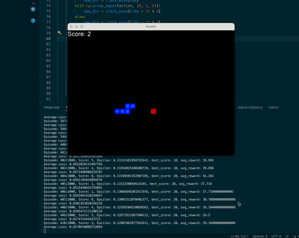

# Reinforcement Learning

Reinforcement learning is a type of machine learning that involves training an agent to interact with an environment and learn the best actions to take in each state. The agent learns by receiving rewards for its actions and updating its policy to maximize the rewards it receives.

In this project, we will implement an agent that learns to play the classic Snake game using reinforcement learning. We will use a deep Q-learning algorithm to train the agent to play the game. Deep Q-learning is a type of reinforcement learning algorithm that uses a deep neural network to approximate the Q-function, which is a function that maps states to actions and their associated rewards.

Let's define some components of the game:

## Reward
Let's define the reward for the game.
- If snake eats food, reward is +10
- If game gets over, reward is -10
- For survival in every step, reward is 0.1

## Action Space
The action space for the Snake game consists of three possible actions:

	1.	Move Straight: Continue moving in the current direction.
	2.	Turn Right: Turn 90 degrees to the right from the current direction.
	3.	Turn Left: Turn 90 degrees to the left from the current direction.

We represent this action space as a one-hot encoded vector:

    1.	Move Straight: [1, 0, 0]
    2.	Turn Right: [0, 1, 0]
    3.	Turn Left: [0, 0, 1]

## State Space
The state space for the Snake game consists of the following components:
1. Danger in the direction of movement
2. Danger to the right of the direction of movement
3. Danger to the left of the direction of movement
4. Direction of movement of the snake (up, down, left, right)
5. Direction of food relative to the head of the snake (up, down, left, right)

We represent the state space as a vector of binary values of length 11

## Training the Agent
We will train the agent using a deep Q-learning algorithm. The agent will interact with the environment by taking actions and receiving rewards. The agent will update its policy based on the rewards it receives and the Q-values it learns from the neural network.

The neural network will take the state space as input and output the Q-values for each action in the action space. The agent will use an epsilon-greedy policy to select actions during training, where it will choose a random action with probability epsilon and the action with the highest Q-value with probability 1-epsilon.

The agent will learn to play the game by updating the Q-values based on the rewards it receives and the Q-values it learns from the neural network. The agent will use experience replay to store and sample experiences from its memory to update the Q-values more efficiently.

### Training in Action
